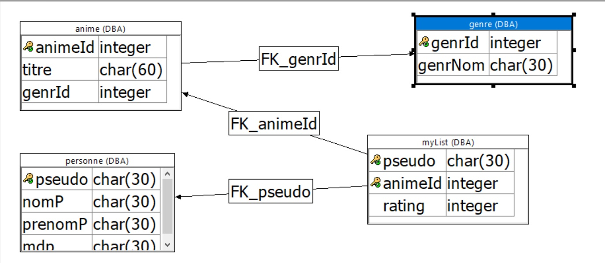

# 1TM1-projetData-MyAnimList 2019-2020
## Présentation de l'équipe
 - **Lucas Silva** 
 - **Cyril Grandjean**
 - **Quentin Servais** 
 - **Mathieu Walravens**
## Description du projet
Le site sera présenté comme un catalogue de nom d’animés.
Les utilisateurs auront la possibilité de créer un profil via un premier formulaire avec un nom, prénom, mot de
passe et un pseudo unique leur permettant de se connecter.
Dès le compte créé chaque utilisateur pourra rechercher dans le catalogue d’animés pour y selectionner ceux qu’il
aura déjà vu.
Les animés seront classés par genre pour permettre aux utilisateurs de découvrir des animés semblable à ceux
qu’ils regardent déjà. Ils pourront ensuite notés les différents animés de leur liste personnelle sur une échelle allant
de 1 à 5.
Chaque animé aura droit à la moyenne de tous les avis des utilisateurs l’ayant visionné pour pouvoir faire un classement des meilleurs animés.
Si jamais il venait à manquer un animé dans le catalogue, les utilisateurs auront la possibilité d’en rajouter un via
un second formulaire en spécifiant son nom et son genre.
###### BESOIN DU CLIENT
  
Notre site MyAnimeList permet à un utilisateur de tenir à jour sa liste personnelle des différents animés qu'ils regardent pour lui donner une note.

###### FONCTIONNALITÉS PRINCIPALES
  - Une page pour ajouter un animé dans sa liste et lui donner une note. L'anime garde la dernière note .
  - Une page pour ajouter un animé dans la base de donnée au cas où il n'y serait pas déjà.
  
    

###### FONCTIONNALITÉS SECONDAIRES
    
  - Une page d'accueil permettant de s'inscrire ou de se connecter sur le site. On y voit tous les animés avec la moyenne des notes de chacun des utilisateurs. Triée par note de la plus haute à la plus basse.
  - Un profil privé accessible uniquement au "propriétaire" du compte, lui permettant de voir et de modifier son AnimeList.
  - Une page listant tous les profils inscrits sur le site, et permettant d'accéder directement à leur profil public via un boutton.
    

## Aspects implémentés
La liste des aspects techniques qu'il faut implémenter pour mettre en place le projet, en séparant les aspects backend (base de données, procédures SQL, webservices, serveur de fichiers) et les aspects frontend (html, css, js, page web et fonctionnalités à proposer aux utilisateurs);
  - Base de données : Table de données pour enregistrer les différents genres et les animés présent sur le site, y stocker les données utilisateurs (pseudo,mdp,...) et garder les liens entre chaque utilisateur et un animé à travers d'une note;
  - Procédures SQL : Liste d'instructions appellées via un web service dans un JS afin d'ammener des informations dans la page ou de modifier la table;
  - Webservices : La plupart des webservices en JSON afin de modifier/ajouter/chercher des données ;
  
  
  - HTML : page comprenant toutes les pages, affichant la page demandée et cachant le reste des pages en attendant 
  - CSS : site le plus esthétique possible, et le plus ergonomique 
  - JS : fonctions appelées lors de l'affichage d'une page ou lors d'un appel de bouton 
  - Fonctionnalités : permet s'inscrire/de se connecter. Egalement de déposer/chercher des tâches, affiner sa recherche de tâche selon differents critères; de mettre des avis/note aux différentes personnes de la communauté, actualiser ses informations; 

## Détail api rest

- #### **Lucas Silva** :
    - *add_mylist* 
      - **Paramètres** : Prend comme paramètres un **token** de connexion (cfr create_token), un **titre** qui est l'id unique de l'animé et une **note** qui est un integer allant de 1 à 5. Toutes ces données sont prises lorsque le formulaire d'ajout d'animé dans sa liste perso est envoyé.
      - **Format de réponse** : Fais appelle à la procédure **add_mylist** qui renvoie un **BOOLEAN** : 1 en cas de succès ou 0 en cas d'échec
      - **Endpoint** : Si l'animé n'est pas déjà dans la liste personnelle de l'utilisateur, le rajoute et lui donne une note entre 1 et 5 compris. Sinon change la note de l'animé déjà présent par la note la plus récente.
    
    - *add_anime* 
      - **Paramètres** : Prend comme paramètres un **titre** qui est un char(60) étant le titre de l'animé et un **genre** qui est un id unique dans la table *genre*. Toutes ces données sont prises lorsque le formulaire d'ajout d'animé est lancé.
      - **Format de réponse** : Fais appelle à la procédure **add_anime** qui renvoie un **BOOLEAN** : 1 en cas de succès ou 0 en cas d'échec
      - **Endpoint** : Si l'animé n'est pas déjà dans la base de donnée commune à tous les utilisateurs, le rajoute et lui donne un genre spécifique(aciton,aventure,...).          
 
- #### **Cyril Grandjean** :
    
- #### **Mathieu Walravens** :
 
- #### **Quentin Servais** :

## Détail DB

- ####Diagramme 
 

- #### Tables
    - ***genre*** : Contient les différents genre disponible
        - **genrId** : [PK][integer] Représente l'identifiant d'un genre particulier ;
        - **genrNom** : [char(30)] Nom du genre ;
    
    -  ***personne*** : Contient tous les utilisateurs ainsi que leurs informations de connexion et profil.
        - **pseudo** : *[PK] [char(30)]* Pseudo unique permettant d'identifier un utilisateur. 
        - **nomP** : *[char(30)]* Nom de l'utilisateur ;
        - **prenomP** : *[char(30)]* Prénom de l'utilisateur ;
        - **mdp** : *[char(30)]* Mot de passe de l'utilisateur utilisé pour se connecter ;
        - **token** : *[char(30)]* Token de session unique donné lors de la connextion 
        permettant à l'utilisateur de ne pas devoir se connecter à chaque fois et de récupérer ses données plus facilement.
    
    - ***anime*** : Contient tous les animes présents sur le site
        - **animeId** : *[PK] [integer]* Représente l'identifiant d'un animé particulier  
        - **genrId** : *[FK] [integer]* Clé étrangère permettant de faire le lien avec la table ***genre***.
        - **titre** : *[char(60)]* Titre de l'animé
    
    - ***myList*** : Contient toutes les notes attribuées par chaque utilisateur et pour chaque animé. (1 note pour 1 utilisateur ET 1 animé)  
        - **pseudo** : *[PK][FK] [char(30)]* Pseudo unique pour faire le lien avec les différents utilisateurs de la table ***personne***
        - **animeId** : *[PK][FK] [integer]* Identifiant unique d'un animé pour faire le lien avec la table ***anime***
        - **rating** : *[integer]* Note de l'animé en question.