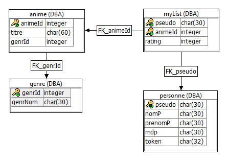

# 1TM1-projetData-MyAnimList 2019-2020
## Présentation de l'équipe
 - **Lucas Silva**
 - **Cyril Grandjean**
 - **Quentin Servais**
 - **Mathieu Walravens**

## Description du projet

###### BESOIN DU CLIENT

Notre site MyAnimeList permet à un utilisateur de tenir à jour sa liste personnelle des différents animés
qu'il regarde et de les noter.

###### FONCTIONNALITÉS PRINCIPALES
  - Une page pour ajouter un animé dans sa liste et lui donner une note. L'anime garde la dernière note.
  - Une page pour ajouter un animé dans la base de donnée au cas où il n'y serait pas déjà.

###### FONCTIONNALITÉS SECONDAIRES

  - Une page d'accueil permettant de voir tous les animés avec la moyenne des notes de chacun des utilisateurs. Triée par note de la plus haute à la plus basse.
  - Un profil privé accessible uniquement au "propriétaire" du compte, lui permettant de voir et de modifier sa liste d'animes.
  - Une page de **connexion**  et d'**inscription** permettant respectivement de se connecter au site et de s'inscrire.

## Aspects implémentés
La liste des aspects techniques qu'il faut implémenter pour mettre en place le projet, en séparant les aspects backend (base de données, procédures SQL, webservices, serveur de fichiers) et les aspects frontend (html, css, js, page web et fonctionnalités à proposer aux utilisateurs);
  - Base de données : Table de données pour enregistrer les différents genres et les animés présent sur le site, y stocker les données utilisateurs (pseudo,mdp,...) et garder les liens entre chaque utilisateur et un animé à travers d'une note;
  - Procédures SQL : Liste d'instructions appelées via un web service dans un JS afin d’amener des informations dans la page ou de modifier la table;
  - Webservices : La plupart des webservices sont en JSON afin de modifier/ajouter/chercher des données ;

  - HTML : page comprenant toutes les pages, affichant la page demandée et cachant le reste des pages en attendant
  - CSS : site le plus esthétique possible, et le plus ergonomique
  - JS : fonctions appelées lors de l'affichage d'une page ou lors d'un appel de bouton
  - Fonctionnalités : permet s'inscrire/de se connecter. Également de déposer/chercher des tâches, affiner sa recherche de tâche selon différents critères; de mettre des avis/note aux différentes personnes de la communauté, actualiser ses informations;

## Détail api rest
#### **Lucas Silva**
  - *add_mylist*
    - **Paramètres** : Prend comme paramètres un **token** de connexion (cfr token), un **titre** qui est l'id unique de l'animé et une **note** qui est un integer allant de 1 à 5. Toutes ces données sont prises lorsque le formulaire d'ajout d'animé dans sa liste perso est envoyé.
    - **Format de réponse** : Fait appel à la procédure **add_mylist** qui renvoie un **BOOLEAN** : 1 en cas de succès ou 0 en cas d'échec
    - **Endpoint** : Si l'animé n'est pas déjà dans la liste personnelle de l'utilisateur, le rajoute et lui donne une note entre 1 et 5 compris. Sinon change la note de l'animé déjà présent par la note la plus récente.

  - *add_anime*
    - **Paramètres** : Prend comme paramètres un **titre** qui est un char(60) étant le titre de l'animé et un **genre** qui est un id unique dans la table *genre*. Toutes ces données sont prises lorsque le formulaire d'ajout d'animé est lancé.
    - **Format de réponse** : Fait appel à la procédure **add_anime** qui renvoie un **BOOLEAN** : 1 en cas de succès ou 0 en cas d'échec
    - **Endpoint** : Si l'animé n'est pas déjà dans la base de donnée commune à tous les utilisateurs, le rajoute et lui donne un genre spécifique(action,aventure,...).

#### **Cyril Grandjean**
  - *getAllAnime*
    - **Paramètres** : Ne possède pas de paramètres.
    - **Format de réponse** : Fait appel à la procédure get_allAnime qui renvoie un objet JSON.
    - **Endpoint** : Rassemble tout les animés de la base de donnée et les trie par ordre alphabétique.

  - *getGenrList*
    - **Paramètres** : Ne possède pas de paramètres.
    - **Format de réponse** : Fait appel à la procédure get_genreList qui renvoie un objet JSON.
    - **Endpoint** : Rassemble tout les genres de la base de donnée et les trie par ordre alphabétique.

  - *verifLog*
    - **Paramètres** : Prend comme paramètre le token de la personne connecter.
    - **Format de réponse** : Renvoie le pseudo de la personne connectée ou la valeur null.
    - **Endpoint** : Si la personne est connectée, renvoie le pseudo. Si la personne n'est pas connectée, renvoie la valeur null.

#### **Mathieu Walravens**
  - *get_top*
    - **Paramètres** : Aucun
    - **Format de réponse** : Fait appel à la procédure **get_top** qui renvoie le **titre**, la **note** et le **genre** de chaque anime noté.
    - **Endpoint** : Sélectionne le titre, la note et le genre de tous les animes noté dans la base de donnée.

  - *add_user*
    - **Paramètres** : Prend comme paramètres un **pseudo**, un **nom**, un **prenom** et un **mdp** (mot de passe).
    - **Format de réponse** : Fait appel à la procédure **add_user** qui renvoie un **BOOLEAN** (*true* en cas de succès), un **message** d'erreur (ou la valeur null s'il n'y en a pas) et le **token** du nouvel utilisateur.
    - **Endpoint** : Crée un nouvel utilisateur dans la base de donnée. Renvoie le token de ce nouvel utilisateur si la création s'est déroulée correctement. Dans le cas contraire, retourne `false` dans le champ `success` et un message d'erreur dans le champ `message` de la réponse.

  - *login*
    - **Paramètres** : Prend en paramètres un **pseudo** et un **mdp** (mot de passe).
    - **Format de réponse** : Fait appel à la procédure **login** qui renvoie le **nom** et le **prenom** de la personne, ainsi qu'un nouveau **token** unique, servant à identifier la personne dans les autres services.
    - **Endpoint** : Vérifie que le pseudo existe et que le mot de passe est correct. Dans le cas où le pseudo et le mot de passe sont corrects, renvoie le nom, prénom et un nouveau token fraîchement créé. Dans le cas contraire, retourne la valeur null dans les trois champs.

#### **Quentin Servais**
  - *getTitre*
    - **Paramètres** : Prend comme paramètre un **token** de type CHAR qui est l'id unique de chaque personne connectée sur le site.
    - **Format de réponse** : Fait appel à la procédure **get_titre** qui renvoie le **titre** ainsi que l'**id** de l'anime concerné sous forme d'objet JSON.
    - **Endpoint** : Sélectionne le titre et l'id des animes dans la liste de la personne connectée.

  - *getAnimeList*
    - **Paramètres** : Prend comme paramètre un **token** qui est l'id unique de chaque personne connectée sur le site.
    - **Format de réponse** : Fait appel à la procédure **get_animeList** qui renvoie le **titre**, la **note** et le **genre** sous forme d'objet JSON.
    - **Endpoint** : Sélectionne et trie par ordre alphabétique le **titre**, la **note** et le **genre** des animes présents dans la liste de la personne identifiée grâce au token.

  - *remove*
    - **Paramètres** : Prend comme paramètres un **token** et l'**id** de l'anime à supprimer.
    - **Format de réponse** : Fait appel à la procédure **removeAnime** qui renvoie un message de suppression.
    - **Endpoint** : Supprime un anime de la liste personnelle de l'utilisateur sur base de son **token** et de l'**id** de l'anime.

## Détail DB
#### Diagramme ER
  

#### Tables
  - ***genre*** : Contient les différents genre disponible
      - **genrId** : *[PK][integer]* Représente l'identifiant d'un genre particulier ;
      - **genrNom** : *[char(30)]* Nom du genre ;

  -  ***personne*** : Contient tous les utilisateurs ainsi que leurs informations de connexion et profil.
      - **pseudo** : *[PK] [char(30)]* Pseudo unique permettant d'identifier un utilisateur.
      - **nomP** : *[char(30)]* Nom de l'utilisateur ;
      - **prenomP** : *[char(30)]* Prénom de l'utilisateur ;
      - **mdp** : *[char(30)]* Mot de passe de l'utilisateur utilisé pour se connecter ;
      - **token** : *[char(32)]* Token de session unique donné lors de la connexion
      permettant à l'utilisateur de ne pas devoir se connecter à chaque fois et de récupérer ses données plus facilement.

  - ***anime*** : Contient tous les animes présents sur le site
      - **animeId** : *[PK] [integer]* Représente l'identifiant d'un animé particulier
      - **genrId** : *[FK] [integer]* Clé étrangère permettant de faire le lien avec la table ***genre***.
      - **titre** : *[char(60)]* Titre de l'animé

  - ***myList*** : Contient toutes les notes attribuées par chaque utilisateur et pour chaque animé. (1 note pour 1 utilisateur ET 1 animé)
      - **pseudo** : *[PK][FK] [char(30)]* Pseudo unique pour faire le lien avec les différents utilisateurs de la table ***personne***
      - **animeId** : *[PK][FK] [integer]* Identifiant unique d'un animé pour faire le lien avec la table ***anime***
      - **rating** : *[integer]* Note de l'animé en question.

### Services de base
  - Un seul service est utilisé pour l'acheminement de toutes les ressources HTML, CSS, JavaScript et images. Ce service, `size`, définit dynamiquement le `Content-Type` de la ressource en fonction de son extension. Si la ressource demandée n'est pas trouvée ou n'existe pas, le service renvoie une erreur `404 - Not Found`.
  - Le service `root` renvoie une redirection (`301 - Moved Permanently`) vers le service `site`.

## Références :
  Nous nous sommes inspirés pour la mise en forme de l'arborescence et du README des excellents projets de certains de nos camarades de classe ainsi que nos profs :
  - https://github.com/Youichii/Project-1TM1
  - https://github.com/lvdEphec/1T-exemple-projet-final

